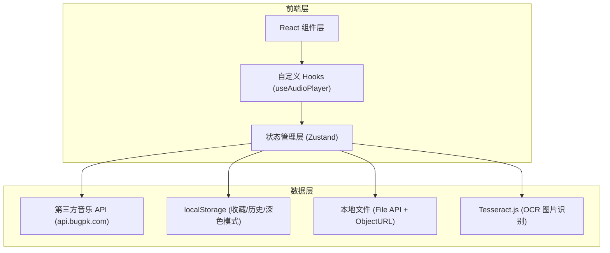

## 1. 架构设计



### 数据流说明

1. **用户操作** → React 组件触发 Zustand action
2. **搜索/播放** → Zustand 调用 `musicApi` 服务 → 第三方 API 返回数据
3. **收藏/历史** → Zustand 写入 localStorage 持久化（本地歌曲不持久化，ObjectURL 页面关闭后失效）
4. **本地导入** → File API 读取文件 → `URL.createObjectURL` 生成播放地址
5. **状态变更** → `useAudioPlayer` Hook 监听 Zustand 变化 → 控制 Audio 实例播放/暂停/切歌
6. **智能推荐** → 从收藏/历史中提取歌手标签 → 并行搜索 API → 去重后推送适配歌曲
7. **漫游模式** → 基于收藏/历史歌手标签搜索 → 预验证播放链接 → 自动播放 + 按序推进
8. **图片识别** → Tesseract.js 本地 OCR → 解析歌名歌手 → 搜索匹配歌曲

## 2. 技术说明

| 技术 | 版本 | 用途 |
|------|------|------|
| React | 18 | 前端 UI 框架，组件化开发 |
| TypeScript | - | 类型安全，编译时发现错误 |
| Vite | 6.x | 构建工具，开发时热更新，生产打包 |
| TailwindCSS | 3 | 原子化 CSS 方案，无需写独立 CSS 文件 |
| Zustand | 5 | 轻量级状态管理，单 store 管理所有播放器状态 |
| Lucide React | - | 图标库（播放、暂停、爱心、星星等图标） |
| clsx | - | 条件类名拼接工具 |
| HTML5 Audio API | - | 浏览器原生音频播放，单例模式 |
| localStorage | - | 浏览器本地存储，持久化收藏列表、播放历史、深色模式偏好 |
| Tesseract.js | 7 | 浏览器端 OCR 识别，用于图片歌单识别 |

### 第三方 API

| API | 地址 | 用途 |
|-----|------|------|
| 网易云音乐 | `api.bugpk.com/api/163_music` | 搜索歌曲、获取播放链接、获取歌词 |
| QQ 音乐 | `api.bugpk.com/api/qqmusic` | 搜索歌曲、获取播放链接+歌词+封面 |

## 3. 路由定义

| 路由 | 用途 |
|------|------|
| / | 播放器主页面（单页应用，无需多路由） |

## 4. 项目目录结构

```
src/
├── main.tsx                    # 入口文件
├── App.tsx                     # 根组件（BrowserRouter + basename）
├── index.css                   # 全局样式（浅绿色背景、自定义滚动条、特效动画）
├── types/
│   └── index.ts                # 类型定义（Song, LyricLine, MusicPlatform 等）
├── services/
│   ├── musicApi.ts             # 音乐 API 封装（网易云 + QQ 音乐）
│   └── ocrService.ts           # OCR 识别服务（Tesseract.js 本地识别 + 歌曲解析）
├── store/
│   ├── playerStore.ts          # Zustand 状态管理（所有播放器状态和逻辑）
│   └── toastStore.ts           # Toast 提示状态管理
├── hooks/
│   └── useAudioPlayer.ts       # 音频播放 Hook（单例 Audio 实例）
├── utils/
│   └── lrcParser.ts            # LRC 歌词解析 + 二分查找
├── pages/
│   └── Home.tsx                # 主页面（组合所有组件 + 特效 + 手机端抽屉 + 键盘快捷键）
└── components/
    ├── PlaylistPanel.tsx        # 左侧面板（搜索/收藏/历史 + 智能推荐 + 漫游 + OCR + 本地导入）
    ├── SongInfo.tsx             # 当前歌曲信息展示
    ├── LyricsDisplay.tsx        # 歌词同步展示（可点击跳转，手动滑动暂停自动滚动）
    ├── VinylDisc.tsx            # 唱片模式（旋转唱片 + 切换按钮）
    ├── ProgressBar.tsx          # 播放进度条（Pointer Events 拖动）
    ├── ControlButtons.tsx       # 播放控制按钮（播放模式/待播队列，支持上下移动/播放/删除）
    ├── VolumeControl.tsx        # 音量控制（桌面内联滑块 + 手机弹出滑块）
    └── Toast.tsx                # Toast 提示组件
```

## 5. 组件结构

```
App
└── Home                         # 主页面
    ├── 手机端菜单按钮           # 左上角音符图标，打开抽屉面板
    ├── 深色模式切换             # 右上角太阳/月亮图标
    ├── 显示模式切换             # 右上角歌词/唱片切换
    ├── PlaylistPanel             # 左侧面板（桌面固定/手机抽屉）
    │   ├── 标题                 # "音瓶"
    │   ├── Tab 切换             # 搜索 / 收藏 / 历史
    │   ├── 平台切换             # 网易云 / QQ音乐
    │   ├── 搜索框 + 工具按钮   # 导入本地 + 图片识别歌单
    │   ├── 搜索结果列表         # 仅搜索后显示
    │   ├── 猜你喜好             # 可折叠，智能推荐 + 换一批
    │   ├── 漫游                 # 可折叠，开始/停止 + 换一批 + 歌曲列表（可删除）
    │   ├── OCR 识别结果         # 识别到的歌曲可点击播放
    │   ├── 收藏列表
    │   └── 历史记录列表
    ├── SongInfo                  # 右上：歌曲名/歌手/专辑/加载状态
    ├── LyricsDisplay             # 右中：歌词同步滚动 + 点击跳转（歌词模式）
    ├── VinylDisc                 # 右中：旋转唱片（唱片模式）
    └── 底部控制区
        ├── ProgressBar          # 进度条（Pointer Events + isSeekingRef）
        ├── 手机端两行布局       # 上行：收藏+音量+辅助控制；下行：主控制
        ├── 桌面端单行布局       # ControlButtons + 收藏 + 音量
        └── VolumeControl        # 桌面内联滑块 / 手机弹出滑块 + 静音切换
```

## 6. 状态管理设计（Zustand Store）

### 6.1 状态字段

```typescript
interface PlayerStore {
  // ===== 播放列表 =====
  playlist: Song[]              // 当前播放列表（最大 200 首）
  currentSong: Song | null      // 当前播放歌曲（独立于 playlist，防止搜索覆盖）
  currentSongIndex: number      // 当前播放歌曲在列表中的索引

  // ===== 播放状态 =====
  isPlaying: boolean            // 是否正在播放（初始 false，不自动播放）
  currentTime: number           // 当前播放时间（秒）
  duration: number              // 当前歌曲总时长（秒）
  volume: number                // 音量（0~1）
  prevVolume: number            // 上次非零音量（用于静音切换）
  audioUrl: string              // 当前歌曲的音频 URL
  isLoading: boolean            // 是否正在加载歌曲

  // ===== 歌词 =====
  lyrics: LyricLine[]           // 当前歌曲的歌词数组
  currentLyricIndex: number     // 当前高亮歌词行索引

  // ===== 搜索 =====
  searchKeyword: string         // 搜索关键词（区分搜索结果和初始推荐）
  isSearching: boolean          // 是否正在搜索
  platform: MusicPlatform       // 当前搜索平台（netease / qq / local）

  // ===== 播放模式 =====
  playMode: PlayMode            // sequential / loop / single / shuffle
  shuffleOrder: number[]        // 随机播放的索引顺序（Fisher-Yates 洗牌）
  shuffleIndex: number          // 当前在随机顺序中的位置

  // ===== 待播队列 =====
  playNextQueue: Song[]         // 待播歌曲队列

  // ===== 收藏 =====
  favorites: Song[]             // 收藏歌曲列表（localStorage 持久化，不含本地歌曲）

  // ===== 播放历史 =====
  history: Song[]               // 播放历史记录（localStorage 持久化，最多 50 条，不含本地歌曲）

  // ===== 智能推荐 =====
  smartRecommend: Song[]        // 智能推荐歌曲列表（基于歌手标签匹配）
  smartRecommendLoading: boolean // 是否正在加载智能推荐

  // ===== 竞态控制 =====
  _loadId: number               // 每次 playSong 递增，防止旧请求覆盖新数据
  _skipCount: number            // 连续跳过计数，超过 5 次停止自动跳过
  _abortController: AbortController | null // 搜索请求取消控制器

  // ===== 漫游模式 =====
  isRoaming: boolean            // 是否开启漫游
  roamSongs: Song[]             // 漫游歌曲列表（预验证可播放）
  roamLoading: boolean          // 是否正在加载漫游歌曲
  _roamPlayIndex: number        // 漫游当前播放索引

  // ===== 定时播放 =====
  sleepTimer: number            // 定时停止剩余秒数
  sleepTimerTotal: number       // 定时停止总秒数

  // ===== 图片识别歌单 =====
  ocrLoading: boolean           // 是否正在识别
  ocrProgress: string           // 识别进度文字
  ocrSongs: Song[]              // 识别到的歌曲列表

  // ===== 显示模式 =====
  displayMode: DisplayMode      // 'lyrics' 歌词模式 / 'vinyl' 唱片模式

  // ===== 深色模式 =====
  darkMode: boolean             // 是否深色模式（localStorage 持久化）
}
```

### 6.2 核心方法

| 方法 | 说明 |
|------|------|
| `playSong(index)` | 播放指定歌曲，写入播放历史，递增 _loadId，更新 shuffle 状态，触发 loadSongData |
| `nextSong()` / `prevSong()` | 下一曲/上一曲，支持待播队列优先、漫游模式、四种播放模式 |
| `togglePlay()` | 切换播放/暂停 |
| `search(keyword)` | 搜索歌曲，替换 playlist 并重置索引和 shuffle 状态 |
| `loadSongData(songId, loadId)` | 加载歌曲播放链接+歌词，失败时自动跨平台搜索，catch 块自动跳过 |
| `cyclePlayMode()` | 切换播放模式（随机模式时生成洗牌顺序） |
| `toggleFavorite(song)` | 收藏/取消收藏（同步写入 localStorage，本地歌曲不持久化） |
| `addToPlayNext(song)` | 添加到待播队列 |
| `addLocalSongs(files)` | 导入本地音乐文件（ObjectURL，ID 为整数避免精度丢失） |
| `loadSmartRecommend()` | 加载智能推荐（从收藏/历史提取歌手标签，并行搜索，去重推送） |
| `playSmartRecommend(index)` | 播放智能推荐歌曲 |
| `toggleRoaming()` | 开启/关闭漫游模式 |
| `loadRoamSongs()` | 加载漫游歌曲（预验证播放链接，并发保护） |
| `playRoamSong(index)` | 播放漫游歌曲（不从列表删除，记录播放索引） |
| `removeRoamSong(index)` | 删除漫游歌曲（调整播放索引） |
| `setVolume(volume)` | 设置音量（自动记录非零值为 prevVolume） |
| `toggleMute()` | 静音切换（恢复到 prevVolume） |
| `restoreProgress()` | 恢复播放进度（加载音频和歌词） |
| `recognizeAndSearch(base64)` | OCR 识别图片歌单并搜索匹配歌曲 |
| `setSleepTimer(minutes)` | 设置定时停止 |
| `setDisplayMode(mode)` | 切换歌词/唱片模式 |
| `toggleDarkMode()` | 切换深色/浅色模式 |

## 7. 数据模型

### 7.1 歌曲数据模型

```typescript
type MusicPlatform = 'netease' | 'qq' | 'local'

interface Song {
  id: number              // 歌曲唯一 ID（本地歌曲为 Date.now() + 随机整数）
  name: string            // 歌名
  artists: string         // 歌手名
  album: string           // 专辑名（本地歌曲存储 ObjectURL）
  picUrl: string          // 封面图 URL
  duration: number        // 时长（毫秒）
  platform: MusicPlatform // 来源平台
  mid?: string            // QQ 音乐歌曲 mid（仅 QQ 平台）
}
```

### 7.2 歌词数据模型

```typescript
interface LyricLine {
  time: number            // 时间戳（秒）
  text: string            // 歌词文本
}
```

### 7.3 搜索结果模型

```typescript
interface SearchResult {
  songs: Song[]           // 搜索结果歌曲列表
  total: number           // 总结果数
}
```

## 8. 关键技术实现

### 8.1 音频播放（单例模式）

- 在 `useAudioPlayer` Hook 中创建唯一 `Audio` 实例，通过 `useRef` 持有
- 只在 `Home.tsx` 中调用一次 `useAudioPlayer()`，通过 props 传递 `seek` 和 `setSeeking` 给子组件
- 避免多个组件各自创建 Audio 实例导致双播问题
- StrictMode 兼容：清理函数重置 `prevAudioUrlRef`，防止重挂载后音频不加载

**切歌流程**：
1. `playSong` 设置 `audioUrl: ''`（清空，表示加载中），递增 `_loadId`
2. `useAudioPlayer` 检测到 `audioUrl` 为空 → 停掉旧音频
3. `loadSongData` 从 API 获取新 URL → 检查 `_loadId` 是否匹配 → 设置 `audioUrl`
4. `useAudioPlayer` 检测到新 URL → 设置 `audio.src` → 自动播放

### 8.2 跨平台降级播放

- 播放失败时自动在另一平台搜索同一首歌（网易云 ↔ QQ 音乐）
- 跨平台回退时使用 `altSong` 完整信息替换，保留正确的平台和 ID
- 异步操作后重新 `get()` 读取最新状态，防止过期数据覆盖
- 每个异步操作后检查 `_loadId` 防止竞态

### 8.3 进度条拖动（Pointer Events + isSeekingRef）

- 使用 `onPointerDown` / `onPointerMove` / `onPointerUp` 替代 `<input type="range">`
- `setPointerCapture` 确保鼠标移出后仍能追踪
- `isSeekingRef`：拖动期间阻止 `timeupdate` 事件覆盖进度条位置
- `seekTargetRef`：记录 seek 目标时间，等 `audio.currentTime` 追上目标后才恢复更新

### 8.4 LRC 歌词解析与同步

- 正则匹配 `[mm:ss.xx]` 格式时间标签，生成 `LyricLine[]` 数组
- 按时间排序后，使用**二分查找**快速定位当前歌词行（O(log n)）
- 点击歌词行调用 `onSeek(line.time)` 跳转到对应时间
- 用户手动滑动时暂停自动滚动 3 秒，切歌时重置滚动状态

### 8.5 随机播放（Fisher-Yates 洗牌）

- 切换到随机模式时，生成一个随机索引数组 `shuffleOrder`
- 使用 Fisher-Yates 洗牌算法确保每首歌只出现一次
- `nextSong` 按洗牌顺序前进，`prevSong` 按洗牌顺序后退
- 播完一轮后自动重新洗牌
- `playSong` 时同步更新 shuffle 状态，确保从收藏/历史等入口播放后随机顺序一致

### 8.6 多平台搜索

- 统一接口 `searchSongs(keyword, platform, limit)` 根据平台分发
- 网易云：`type=search&s=关键词` → 返回歌曲列表（含封面）
- QQ 音乐：`type=search&name=关键词` → 返回歌曲列表（含 mid）
- 播放时根据 `song.platform` 调用不同 API 获取播放链接
- 搜索替换 playlist 时重置 `currentSongIndex`、`shuffleOrder`、`shuffleIndex`

### 8.7 本地音乐导入

- 通过 `<input type="file" accept="audio/*" multiple>` 选择文件
- `URL.createObjectURL(file)` 生成临时播放地址
- 本地歌曲 `platform: 'local'`，播放时跳过 API 调用，直接使用 ObjectURL
- ID 使用 `Date.now() + Math.floor(Math.random() * 10000)` 整数，避免 JSON 序列化精度丢失
- 本地歌曲不持久化到 localStorage（ObjectURL 页面关闭后失效）

### 8.8 数据持久化

| 数据 | 存储位置 | 说明 |
|------|----------|------|
| 收藏列表 | `localStorage: music_favorites` | 收藏/取消收藏时实时写入，过滤本地歌曲 |
| 播放历史 | `localStorage: music_history` | 播放歌曲时自动写入，最多 50 条，过滤本地歌曲 |
| 播放进度 | `localStorage: music_progress` | 每 5 秒保存一次当前播放位置 |
| 深色模式 | `localStorage: music_darkMode` | 切换时写入 |

### 8.9 智能推荐（猜你喜好）

- 从收藏和历史中提取歌手名，统计出现频率
- 取前 3 个最常听的歌手，使用 `Promise.all` 并行搜索（约 1 秒加载完成）
- 自动去重：排除已播放过、收藏过的歌曲
- 最多推荐 15 首，支持"换一批"刷新
- 始终显示区域，无收藏/历史时显示引导提示

### 8.10 漫游模式

- 基于收藏/历史的歌手标签，随机选 3 个歌手并行搜索
- 预验证播放链接（`Promise.allSettled` 批量验证），只保留可播放的歌曲
- 使用 `_roamPlayIndex` 追踪当前播放位置，播放后不从列表删除
- 支持手动删除漫游歌曲，删除时自动调整播放索引
- 播放完所有漫游歌曲后清空旧列表再加载新的，避免重播
- 剩余不足 3 首时自动加载更多，`roamLoading` 并发保护

### 8.11 图片识别歌单

- 使用 Tesseract.js 在浏览器端本地识别图片文字（中文简体+英文）
- 解析歌名和歌手（支持 `歌名 - 歌手`、`歌名—歌手`、`歌名 歌手` 等格式）
- 并行搜索匹配歌曲（最多 3 个并发），优先网易云，无结果尝试 QQ 音乐
- 识别结果可点击播放或一键加入待播队列

### 8.12 竞态条件防护

- 每次 `playSong` 递增 `_loadId`
- `loadSongData` 异步请求完成后检查 `_loadId` 是否匹配
- 跨平台回退的每个异步操作后都检查 `_loadId`
- 若不匹配说明用户已切了别的歌，丢弃旧数据，防止歌名与歌词不匹配

### 8.13 连续跳过保护

- `_skipCount` 记录连续无法播放的次数
- `loadSongData` 的 null URL 路径、catch 块、`useAudioPlayer` 的 `handleError` 都使用同一计数器
- 连续跳过 5 次后停止自动跳过，显示提示
- 成功播放时重置计数

### 8.14 手机端响应式

- 桌面端：左侧面板固定 320px，右侧自适应
- 手机端（<768px）：左侧面板变为从左侧滑出的抽屉，点击遮罩关闭
- 左上角显示菜单按钮（音符图标），点击打开抽屉
- 手机端底部控制两行布局：上行辅助控制（收藏+音量+辅助按钮），下行主控制
- 手机端歌曲行收藏/加入待播按钮始终可见
- 手机端音量控制为弹出式滑块面板
- 键盘快捷键：Space 播放/暂停，方向键切歌/调音量，M 静音，L 切换显示模式

### 8.15 currentSong 独立状态

- `currentSong` 独立于 `playlist[currentSongIndex]`，防止搜索覆盖当前播放信息
- 只在 `playSong` 时设置，搜索替换 playlist 不影响当前显示
- `SongInfo`、`VinylDisc`、`LyricsDisplay` 等组件使用 `currentSong` 获取歌曲信息

## 9. 已解决的问题

| 问题 | 原因 | 解决方案 |
|------|------|----------|
| 多首歌同时播放 | 多个组件各自创建 Audio 实例 | 单例模式 + props 传递 seek/setSeeking |
| 进度条拖动跳动 | timeupdate 在拖动期间持续覆盖 | isSeekingRef + seekTargetRef |
| 搜索重置播放状态 | search 函数重置了 isPlaying 等 | search 只更新 playlist，不触碰播放状态 |
| 歌词滚动不跟随 | children 取到外层 div | innerRef 指向歌词行父容器 |
| 待播队列被清空 | 切歌时 audio.src='' 触发 error 事件，误调 nextSong | handleError 中检查 audioUrl 为空则跳过 |
| 随机播放不随机 | 每次随机选一首，体验差 | Fisher-Yates 洗牌生成完整随机顺序 |
| 歌名与歌词不匹配 | 快速切歌时旧请求结果覆盖新数据 | _loadId 竞态防护，旧请求完成后检查 ID 丢弃过期数据 |
| 搜索歌不播放但主页显示搜索的歌 | SongInfo 用 playlist[currentSongIndex]，搜索覆盖 playlist | 新增 currentSong 独立状态，只在 playSong 时设置 |
| 手机端控制按钮挤在一起 | 所有按钮一行排列 | 两行布局：上行辅助控制，下行主控制 |
| 漫游歌曲大部分无法播放 | VIP/版权限制歌曲未过滤 | 预验证播放链接，只保留可播放的歌曲 |
| 播放失败频繁 | 网易云歌曲播放失败直接跳过 | 自动尝试另一平台搜索同一首歌 |
| 换一批按钮不工作 | rightAction 嵌套在 onToggle button 内，点击冒泡触发折叠 | 将 rightAction 从 button 中移出，标题和操作按钮分离 |
| 换一批无提示/图标不旋转 | loading 状态在条件检查后才设置 | 函数开头立即设置 loading，提前 return 时设为 false |
| StrictMode 下音频不加载 | prevAudioUrlRef 未在清理函数中重置 | 清理函数中重置 prevAudioUrlRef.current = '' |
| isPlaying 切换后不播放 | readyState >= 1 检查过严 | 移除检查，直接调用 audio.play() |
| 本地歌曲 ObjectURL 持久化后失效 | 页面关闭后 ObjectURL 失效 | saveFavorites/saveHistory 过滤本地歌曲 |
| 音量 prevVolume 与快捷键不同步 | prevVolume 是组件局部状态 | 移入 store，setVolume 自动记录，新增 toggleMute |
| 本地歌曲 ID 浮点数精度丢失 | Date.now() + Math.random() 产生浮点数 | 改为 Date.now() + Math.floor(Math.random() * 10000) |
| 待播队列移动按钮键盘可触发 | invisible 但未 disabled | 添加 disabled 属性 |
| restoreProgress 不加载音频 | 只设置了状态未调用 loadSongData | 添加 loadSongData 调用和 _loadId 递增 |
| shuffle 模式 nextSong 切换播放模式 | shuffleOrder 为空时调用 cyclePlayMode | 重新生成随机顺序而非切换模式 |
| 跨平台回退使用过期状态 | playlist/index 在函数开头捕获 | 异步操作后重新 get() 读取最新状态 |
| 跨平台回退 ID 不匹配 | 用原始 ID 覆盖新平台歌曲 ID | 使用 altSong 完整信息，不覆盖 ID |
| 搜索替换 playlist 不重置索引 | currentSongIndex 未更新 | 搜索结果替换时重置索引和 shuffle 状态 |
| playSong 不更新 shuffle 状态 | shuffle 模式下从其他入口播放后顺序混乱 | playSong 中同步更新 shuffleOrder 和 shuffleIndex |
| 漫游播放完重播旧歌 | _roamPlayIndex 重置为 -1 但旧歌曲仍在 | 播放完后先清空 roamSongs 再加载新的 |
| handleError 无限跳过 | 不受 _skipCount 限制 | 添加 _skipCount 计数，连续 5 次后停止 |
| loadSongData catch 不自动跳过 | 只停止播放不跳下一首 | catch 块添加自动跳过逻辑，受 _skipCount 限制 |
| loadRoamSongs 并发问题 | 多次调用可能覆盖结果 | 开头检查 roamLoading，正在加载时直接 return |
