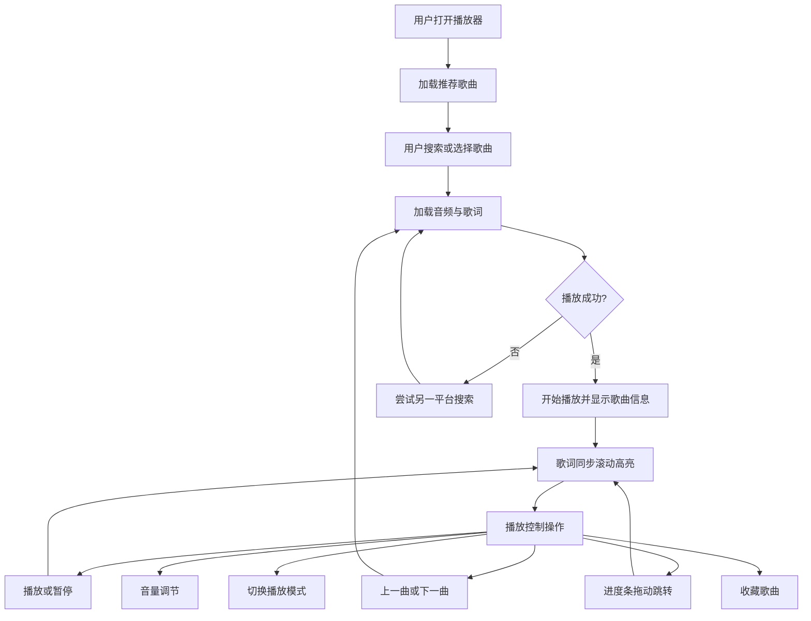

## 1. 产品概述

音瓶——一款基于 Web 的在线音乐播放器，支持网易云音乐和 QQ 音乐双平台搜索播放，具备歌词同步、收藏管理、播放历史、待播队列、本地音乐导入、智能推荐、漫游模式、图片识别歌单、唱片模式、深色模式等功能。面向喜欢在电脑和手机上听音乐的用户，提供简洁优雅的播放体验。

## 2. 核心功能

### 2.1 功能模块

1. **播放器主页面**：搜索/播放列表、歌曲信息、播放控制、进度条、音量调节、歌词展示/唱片模式、收藏、历史记录

### 2.2 功能清单

| 模块 | 功能 | 描述 |
|------|------|------|
| 搜索 | 多平台搜索 | 支持网易云音乐和 QQ 音乐搜索，可切换平台 |
| 搜索 | 猜你喜好 | 基于收藏和播放历史的歌手标签智能推荐，可点击"换一批"刷新，可折叠 |
| 搜索 | 本地导入 | 支持导入本地音频文件（mp3/wav 等） |
| 搜索 | 图片识别歌单 | 上传截图识别歌名歌手，搜索匹配歌曲，可点击播放或加入待播 |
| 播放 | 播放/暂停 | 播放控制，歌曲播完自动切下一首，不默认开启自动播放 |
| 播放 | 上一曲/下一曲 | 切换歌曲 |
| 播放 | 播放模式 | 顺序播放、列表循环、单曲循环、随机播放（Fisher-Yates 洗牌） |
| 播放 | 进度条 | 显示播放进度，支持拖动跳转，显示当前时间/总时长 |
| 播放 | 音量控制 | 音量滑动调节，点击图标静音/恢复，手机端弹出式滑块 |
| 播放 | 跨平台降级 | 播放失败自动尝试另一平台搜索同一首歌 |
| 播放 | 定时停止 | 设置 10/20/30/60 分钟后自动停止播放 |
| 播放 | 键盘快捷键 | Space 播放/暂停，方向键切歌/调音量，M 静音，L 切换显示模式 |
| 歌词 | 歌词同步 | LRC 格式歌词同步滚动，当前行高亮，手动滑动暂停自动滚动 |
| 歌词 | 点击跳转 | 点击歌词行跳转到对应播放时间 |
| 唱片 | 唱片模式 | 旋转唱片展示，播放时旋转，暂停时停止，右上角切换按钮 |
| 收藏 | 收藏歌曲 | 在播放页或列表中收藏歌曲，爱心特效 |
| 收藏 | 收藏列表 | 在收藏 Tab 查看所有收藏歌曲 |
| 收藏 | 批量加入待播 | 一键将所有收藏歌曲加入待播队列 |
| 待播 | 待播队列 | 添加歌曲到"下一首播放"，队列优先于播放模式 |
| 待播 | 队列管理 | 查看待播队列，支持播放、上下移动、删除单首和清空 |
| 历史 | 播放历史 | 自动记录播放过的歌曲（最多 50 条），支持清空 |
| 历史 | 历史播放 | 点击历史记录中的歌曲可直接播放 |
| 漫游 | 漫游模式 | 基于收藏/历史歌手标签推荐新歌，预验证可播放，自动播放 |
| 漫游 | 漫游管理 | 支持换一批、手动删除歌曲，播放后不从列表删除 |
| 显示 | 深色模式 | 支持浅色/深色主题切换，偏好持久化 |
| 显示 | 歌词/唱片切换 | 右上角切换歌词模式和唱片模式 |

## 3. 核心流程

### 3.1 搜索播放流程

用户打开播放器 → 自动加载推荐歌曲 → 搜索或选择歌曲 → 歌曲开始播放并显示信息 → 歌词同步滚动展示 → 用户可通过进度条跳转、音量滑块调节、上下曲切换控制播放。

### 3.2 智能推荐流程

用户收藏歌曲或播放歌曲 → 系统从收藏和历史中提取歌手名 → 统计歌手出现频率 → 取前 3 个最常听的歌手 → 并行搜索这些歌手的歌曲 → 去重后展示推荐列表。

### 3.3 漫游流程

用户点击开始漫游 → 系统从收藏/历史提取歌手标签 → 随机选 3 个歌手并行搜索 → 预验证播放链接 → 展示可播放歌曲 → 自动播放第一首 → 播完按序推进 → 剩余不足 3 首自动加载更多 → 播完所有后清空加载新一批。

### 3.4 待播队列流程

用户在歌曲列表点击"+" → 歌曲加入待播队列 → 当前歌曲播完 → 优先播放待播队列第一首 → 播完从队列移除 → 队列为空后按播放模式继续。

### 3.5 图片识别歌单流程

用户点击"图片识别歌单" → 选择截图 → Tesseract.js 本地 OCR 识别文字 → 解析歌名和歌手 → 并行搜索匹配歌曲 → 展示识别结果 → 可点击播放或加入待播。

### 3.6 本地导入流程

用户点击"导入本地音乐" → 选择本地音频文件 → 文件添加到播放列表 → 点击即可播放。

## 4. 用户界面设计

### 4.1 设计风格

- **产品名称**：音瓶
- **主题**：浅绿色清新风格 / 深色模式
- **主色调**：浅绿色背景（#f0fdf4），搭配橙色强调色（#ea580c）
- **次色调**：中灰色用于文字和边框（#6B7280），白色用于卡片背景
- **按钮风格**：圆形图标按钮，悬停时变色，播放按钮带阴影
- **字体**：歌名使用粗体，歌手名使用细体小字号
- **布局风格**：左侧播放列表面板 + 右侧主内容区（歌词/唱片+控制面板）
- **图标风格**：线性图标，统一使用 Lucide React 图标库
- **动效**：收藏爱心飞出特效，加入待播 +1 特效，歌词行高亮渐变，刷新按钮旋转动画，唱片旋转

### 4.2 页面设计概览

| 区域 | 模块 | UI 元素 |
|------|------|---------|
| 左侧面板 | 标题 | "音瓶" |
| 左侧面板 | Tab 切换 | 搜索/收藏/历史 三个 Tab，带图标和数量角标 |
| 左侧面板 | 平台切换 | 网易云（红色）/ QQ音乐（绿色）切换按钮 |
| 左侧面板 | 搜索框 | 带搜索图标的输入框 + 搜索按钮 |
| 左侧面板 | 工具按钮 | 导入本地音乐 + 图片识别歌单 |
| 左侧面板 | 猜你喜好 | 可折叠，紫色星星图标标题 + "换一批"刷新按钮（旋转动画） |
| 左侧面板 | 漫游 | 可折叠，指南针图标标题 + 开始/停止 + 换一批 + 歌曲列表（可删除） |
| 左侧面板 | OCR 结果 | 识别到的歌曲列表，可点击播放或加入待播 |
| 左侧面板 | 收藏列表 | 歌曲列表，每首带取消收藏和加入待播按钮（手机端始终可见） |
| 左侧面板 | 历史记录 | 歌曲列表，顶部有"清空"按钮，每首带加入待播按钮 |
| 右侧上部 | 歌曲信息 | 大号歌名 + 歌手 + 专辑，加载时显示加载状态 |
| 右侧中部 | 歌词展示 | 居中排列歌词行，当前行橙色高亮+放大，可点击跳转（歌词模式） |
| 右侧中部 | 唱片展示 | 旋转唱片 + 右上角切换按钮（唱片模式） |
| 右上角 | 显示切换 | 歌词/唱片模式切换按钮 |
| 右上角 | 深色切换 | 太阳/月亮图标切换深色模式 |
| 右侧底部 | 进度条 | 细长圆角进度条，拖动手柄，左侧当前时间右侧总时长 |
| 右侧底部 | 播放控制 | 桌面端单行：播放模式/上一曲/播放暂停/下一曲/待播队列 |
| 右侧底部 | 手机端控制 | 两行布局：上行收藏+音量+辅助控制，下行主控制 |
| 右侧底部 | 收藏按钮 | 爱心按钮，收藏时爱心飞出特效 |
| 右侧底部 | 音量控制 | 桌面端内联滑块 / 手机端弹出滑块 + 静音切换 |

### 4.3 响应式设计

- 桌面端：左侧面板固定 320px，右侧自适应
- 手机端（<768px）：左侧面板变为从左侧滑出的抽屉，点击遮罩关闭
- 左上角显示菜单按钮（音符图标），点击打开抽屉
- 选歌后自动关闭抽屉
- 手机端底部控制两行布局，防止按钮挤在一起
- 手机端歌曲行收藏/加入待播按钮始终可见
- 手机端音量控制为弹出式滑块面板

## 5. 数据来源

| 来源 | 说明 |
|------|------|
| 网易云音乐 API | 通过 api.bugpk.com 接口搜索和播放网易云歌曲，支持 SVIP 音质 |
| QQ 音乐 API | 通过 api.bugpk.com 接口搜索和播放 QQ 音乐歌曲 |
| 本地文件 | 用户通过文件选择器导入本地音频文件 |
| localStorage | 收藏列表、播放历史、播放进度、深色模式偏好持久化存储 |
| Tesseract.js | 浏览器端本地 OCR 识别，用于图片歌单识别 |

## 6. 非功能需求

| 需求 | 说明 |
|------|------|
| 性能 | 歌曲切换流畅，歌词同步无卡顿，智能推荐并行加载约 1 秒完成 |
| 兼容性 | 支持主流浏览器（Chrome、Edge、Firefox），支持手机端访问 |
| 可用性 | 搜索不影响当前播放，切歌自动播放，不默认开启自动播放 |
| 可靠性 | 加载失败自动跳下一首（连续 5 次后停止），跨平台降级播放，竞态防护防止歌名与歌词不匹配 |
| 持久化 | 收藏和播放历史关闭浏览器后保留，播放进度自动保存 |
| 安全性 | 本地歌曲 ObjectURL 不持久化到 localStorage，避免失效引用 |
